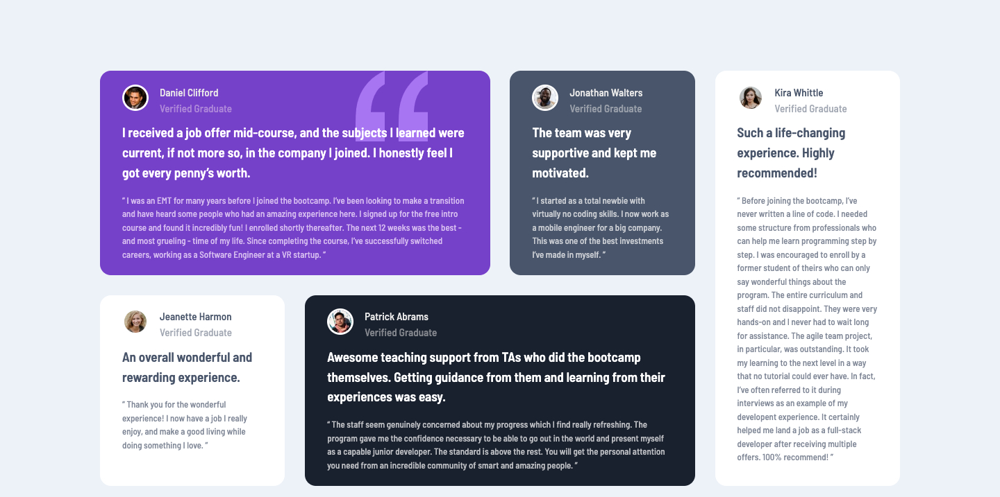

# testimonials-grid-section-main
This is a solution to the [Testimonials grid section challenge on Frontend Mentor](https://www.frontendmentor.io/challenges/testimonials-grid-section-Nnw6J7Un7). Frontend Mentor challenges help you improve your coding skills by building realistic projects. 

## Table of contents

- [Overview](#overview)
  - [The challenge](#the-challenge)
  - [Screenshot](#screenshot)
  - [Links](#links)
- [My process](#my-process)
  - [Built with](#built-with)
  - [What I learned](#what-i-learned)
- [Author](#author)


**Note: Delete this note and update the table of contents based on what sections you keep.**

## Overview

### The challenge

Users should be able to:

- View the optimal layout for the site depending on their device's screen size

### Screenshot




### Links

- Solution URL: [Add solution URL here](https://github.com/AustinKing5/testimonials-grid-section-main)
- Live Site URL: [Add live site URL here](https://your-live-site-url.com](https://austinking5.github.io/testimonials-grid-section-main/)

## My process

### Built with

- Semantic HTML5 markup
- CSS custom properties
- CSS Grid
- Desktop-first workflow


### What I learned

I learnt how to make css grid responsive.

```html
<h1>Some HTML and CSS codes I'm proud of</h1>
 <article class="Jonathan">
        
        <h3>Jonathan Walters<br>
          <span> Verified Graduate</span></h3>
        <h4>The team was very supportive and kept me motivated.</h4>
        <blockquote>
          “ I started as a total newbie with virtually no coding skills. I now
          work as a mobile engineer for a big company. This was one of the best
          investments I’ve made in myself. ”
        </blockquote>
      </article>
```
```css
.container{
    grid-template-columns: repeat(3, 1fr);
}

.Daniel{
    grid-column: 1 / 3;
    grid-row: 1 / 2;
}
.Jonathan{
    grid-column: -3 / -2;
    grid-row: 3 / 4;
}
.Jeanette {
    background-color: white;
    grid-column: -4 / -3;
    grid-row: 3 / 4;
}
```

## Author

- Website - [Augustine Aryeteh Asare](https://github.com/AustinKing5)
- Frontend Mentor - [@@AustinKing5](https://www.frontendmentor.io/profile/AustinKing5)
- Twitter - [@aryetehasare](https://www.twitter.com/aryetehasare)

